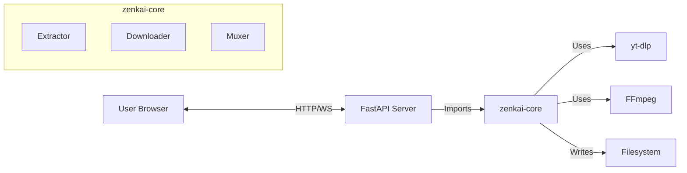

# Architecture: zenkai-dl (Web Edition)

## 1. Overall System Design

**zenkai-dl** follows a **Client-Server** architecture powered by a modular core.

*   **zenkai-core**: The headless logic engine (Python Package). Handles extraction, download, and processing.
*   **zenkai-web**: The backend server (FastAPI) and frontend UI.
    *   **API Layer**: REST endpoints to fetch info, start downloads, and stream progress.
    *   **UI Layer**: A clean, responsive web interface (HTML/CSS/JS) for user interaction.

### Advantages
*   **Accessibility**: Use from any device on the network (phone, tablet, laptop).
*   **Concurrency**: FastAPI handles multiple users/downloads efficiently via async.
*   **Visual Feedback**: Real-time progress bars and status updates via WebSockets/SSE.

## 2. Data Flow

1.  **Request**: User enters URL in Web UI -> sends request to `/api/extract`.
2.  **Extraction**: `zenkai-core` fetches metadata via `yt-dlp`.
    *   *Result*: JSON returned to Frontend to display format options.
3.  **Selection**: User selects video (e.g., 1080p) + audio -> Request to `/api/download`.
4.  **Download Job**:
    *   Server spawns a background task.
    *   `zenkai-core` downloads streams to `temp/`.
    *   **Progress**: Server pushes updates to UI via Server-Sent Events (SSE) or WebSockets.
5.  **Processing**:
    *   `FFmpeg` merges streams.
6.  **Delivery**:
    *   File moved to `downloads/`.
    *   UI shows "Download Complete" with a link to stream or download the file.

## 3. Technology Stack

### Backend
*   **Python 3.10+**
*   **FastAPI**: For high-performance async API.
*   **zenkai-core**: Our internal logic library.
    *   *yt-dlp* (Extraction)
    *   *FFmpeg* (Processing)

### Frontend
*   **HTML5 / CSS3**: Clean, modern UI (likely using Tailwind CSS).
*   **JavaScript**: For API interaction and DOM updates.
*   **HTMX** (Optional): For simplified dynamic interactions.

## 4. Component Diagram

